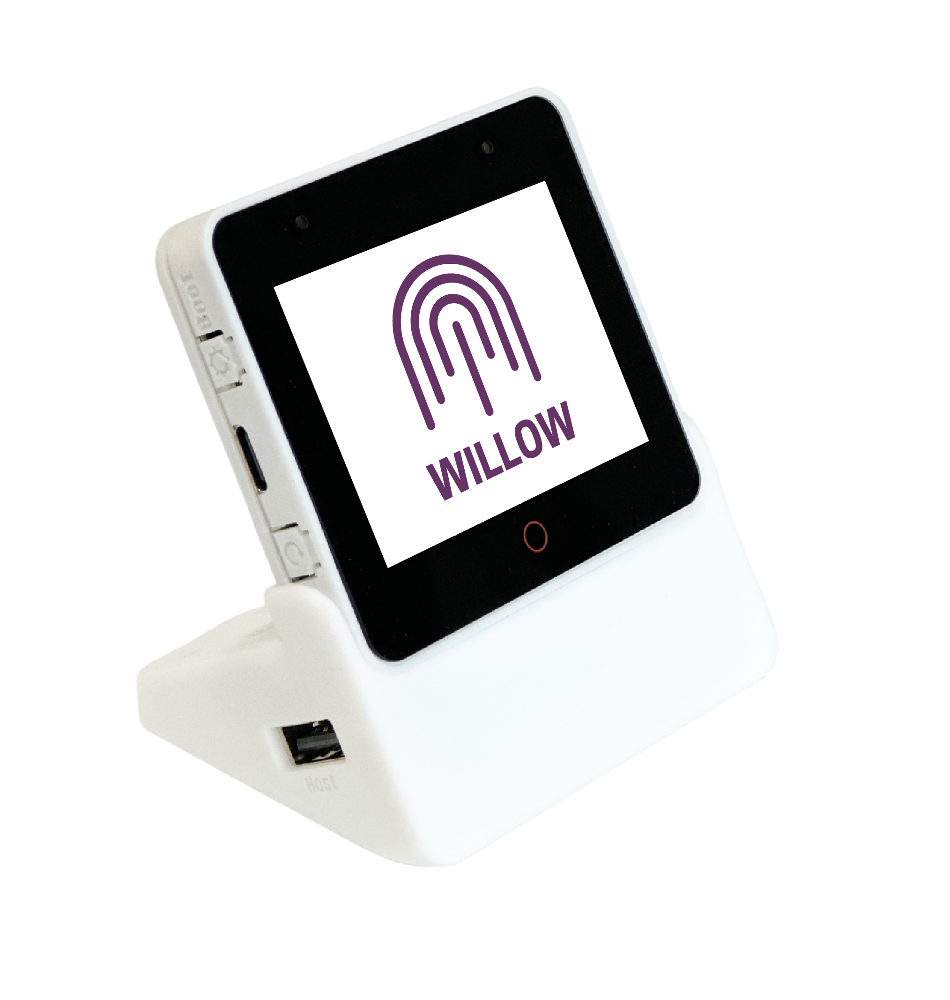
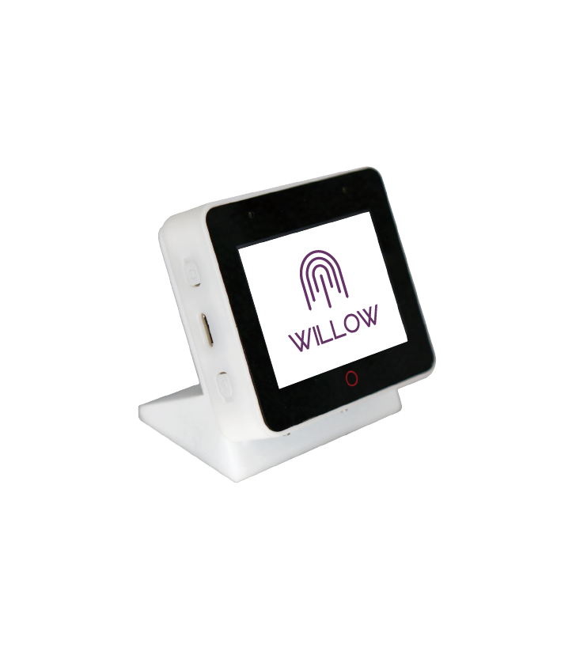
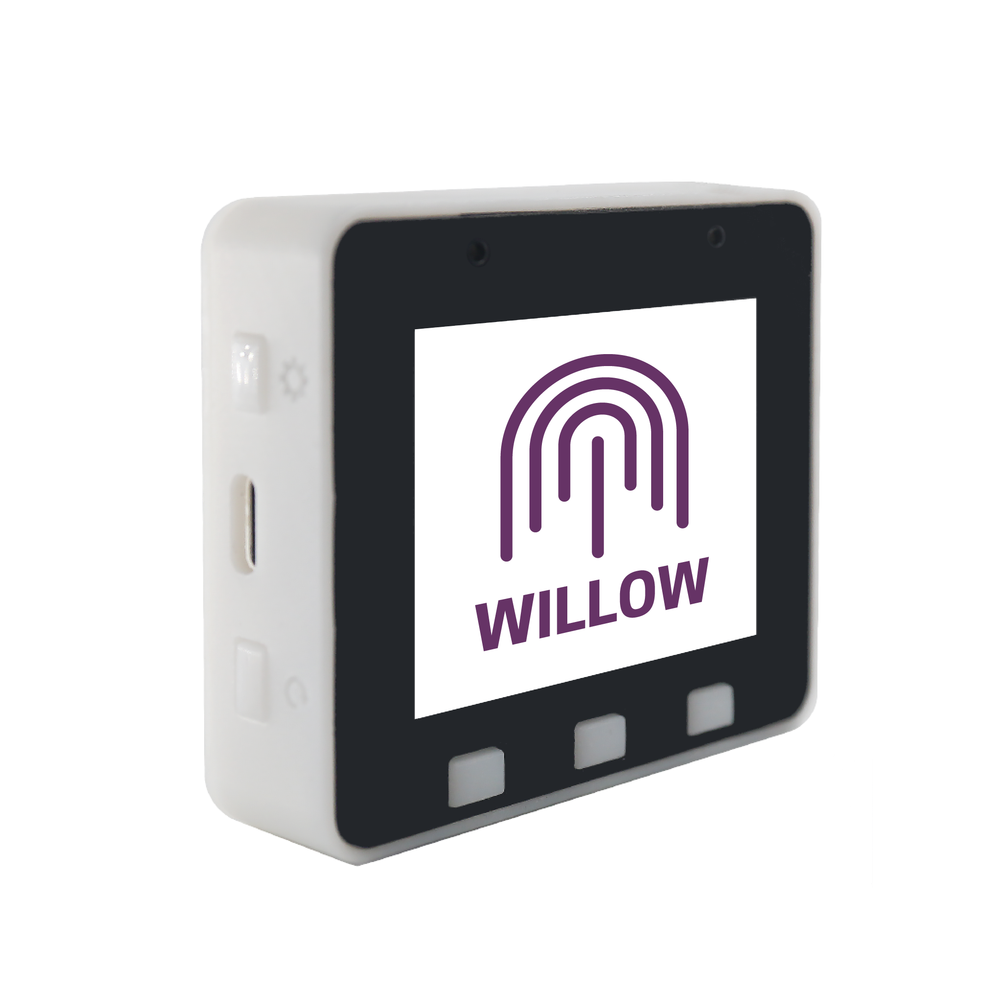

# Hardware

The ESP32-S3-BOX family is the primary supported hardware platform for Willow. It's what we develop on, it's what we target, and it's what we support.

## ESP32-S3-BOX-3
{: width=300px align=center}

The new [BOX-3](https://www.espressif.com/en/news/ESP32-S3-BOX-3) is an ESP BOX that supports additional modules like sensors, breadboards, and more.

## ESP32-S3-BOX (Discontinued)
{: width=300px align=center}

Out of the box the [ESP32-S3-BOX](https://github.com/espressif/esp-box/blob/master/docs/hardware_overview/esp32_s3_box/hardware_overview_for_box.md) is near perfect for Willow. However, in a perfect world there is one manufacturing change we would make...

### Power LED Hack

The green power LED on the top right of the enclosure is not connected via GPIO. Per the [schematic](https://github.com/espressif/esp-box/blob/master/hardware/esp32_s3_box_v2.5/schematic/SCH_ESP32-S3-BOX_V2.5_20211011.pdf) it is connected directly to a 3.3v buck converter coming from 5 VIN. Because of this it is EXTREMELY bright. For many usage scenarios we suggest that more advanced (and brave) users disable this LED.

!!! danger "Opening the enclosure always runs the risk of breaking something!"

If you accept this risk you can disable the power LED by opening the enclosure and de-soldering or breaking it off the PCB. We have successfully done this across several boxes without issue.

It is our hope that in future revisions Espressif connects this LED via GPIO so we can control its function, brightness, etc.

## ESP32-S3-BOX-Lite
{: width=300px align=center}

!!! danger "We ***DO NOT*** recommend purchasing an ESP32-S3-BOX-Lite for Willow."

The Lite is a variant of the BOX that doesn't include a dock or touchscreen. We don't recommend it because the lack of a dock and touch screen limits what you can do with Willow!

### Power Supplies

ESP Boxes are very low power. They call for a 5V 1A power supply and we have observed them using a fraction of that. However, we haven't been able to find readily-available (CHEAP) lower amperage (1A) USB-C power supplies. If you know where to get one let us know!

## Expansion (GPIO, etc)

EXP Boxes expose 16 rear GPIOs that enable users to have the best of both worlds - an attractive and ready to go enclosure that would not look out of place in any installation but also exposes more advanced "maker-type" functionality.

We are currently considering the best way to go about user control of these GPIOs. Ideally we could use esphome or some other established/standard way to configure them but we haven't completely thought this through yet.

## Other ESP32-S3 Based Boards

The ESP32 S3 is what really "makes the magic happen" for Willow as the high speed PSRAM enables a lot of the more advanced neural features. It is certainly possible that Willow can run on other ESP32-S3 based boards but supporting these is up to you!

In the future we may officially support other ESP32-S3 (or successor series) based boards but they are not supported at this time.

## Other Espressif Boards

Per the ESP ADF and ESP-SR documentation regular plain 'ol ESP32 boards can run some speech features. However, they are so limited the experience isn't what we would call acceptable to meet our goals of removing creepy corporate microphones from your environment without any compromises.

We have not investigated support for any other ESP32 based platforms such as the C series.