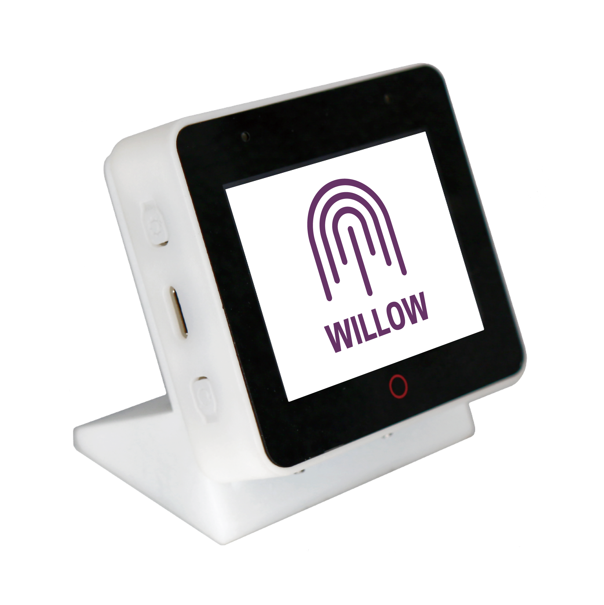

---
hide:
  - toc
title: Home
description: A Practical, Open Source, Privacy-Focused Platform for Voice Assistants and other Applications
---

# Willow Is a Practical, Open Source, Privacy-focused Platform for Voice Assistants and Other Applications

{: width=125px align=left}

Willow is an [ESP IDF](https://github.com/espressif/esp-idf) based project primarily targeting the [ESP32-S3-BOX](https://github.com/espressif/esp-box) hardware from Espressif. Our goal is to provide Amazon Echo/Google Home competitive performance, accuracy, cost and functionality with [Home Assistant](https://www.home-assistant.io/), [openHAB](https://www.openhab.org/) and other platforms.

100% open source and completely self-hosted by the user with "ready for the kitchen counter" low cost commercially available hardware.

<iframe width="560" height="315" src="https://www.youtube-nocookie.com/embed/8ETQaLfoImc" title="Willow Demo" frameborder="0" allow="accelerometer; autoplay; clipboard-write; encrypted-media; gyroscope; picture-in-picture; web-share" allowfullscreen></iframe>

{: width=300px align=right}

**FAST** - Response times faster than Alexa/Echo or Google Home. From end of speech to action completed in 500ms or less. If you're curious how it's so fast (and accurate) you can watch the [technical deep dive](https://www.youtube.com/watch?v=WvgeSp94ZWE).

**ACCURATE** - High wake word accuracy, low false activation, and speech recognition powered by our [Willow Inference Server](willow-inference-server.md) or command recognition solely on the device.

**RELIABLE** - We've tested thousands of cycles of voice commands with a < 1% failure rate. No one likes to repeat themselves!

**FLEXIBLE** - Use Willow Inference Server anywhere or don't use it at all with command recognition on the device. Have the results go anywhere you want. Integrate with whatever you want. Completely open source so it does what you want, only what you want, and only how you want it. No more annoying extra prompts or sales pitches to upsell you. Supports multiple wake words with more coming soon.

**PRIVATE** - Check the source. Build and flash yourself. Proxy through another server to inspect traffic. Use on your own server. Use only local commands. Use on a network without access to the internet. Dig as deep as you want because you're not going to find anything fishy here!

**PRACTICAL AND NOT UGLY** - Ready to go! Take it out of the box, flash, and put it in your home or office in minutes without getting looks from people wondering what that "thing" is. Install as many as you like.

**CHEAP** - Approximately $50 hardware cost (plus USB-C power supply). Fully assembled. Done.

**LOW POWER** - 100mW power usage.

Current supported features include:

- Wake Word Engine. Say "Hi ESP" or "Alexa" (user selectable) and start talking!
- Voice Activity Detection. When you stop talking it will stop listening and take action.
- Support for [Home Assistant](https://www.home-assistant.io/), [openHAB](https://www.openhab.org/) and generic REST APIs! 
- Support for other platforms. As long as your configured endpoint can take an HTTP POST you can do anything with the speech output!
- Great far-field performance. We've tested wake and speech recognition from roughly 25 feet away in challenging environments with good results.
- Great audio quality. Willow provides features such as automatic gain control, acoustic echo cancellation, noise suppression, blind source separation, etc.
- Support for challenging Wi-Fi environments. Willow can (optionally) use audio compression to reduce airtime on 2.4 GHz Wi-Fi in cases where it's very busy.
- LCD and touchscreen. The ESP32-S3-BOX has color LCD and capacitive multi-point touchscreen. We support them with an initial user interface.
- Completely on device speech command recognition and support for our open source [Willow Inference Server](https://github.com/toverainc/willow-inference-server) (Tovera hosted best-effort WIS provided). Configure up to 400 commands completely on device or self-host our inference server to transcribe any speech!

All with hardware you can order online today (Amazon, AliExpress, Adafruit, The Pi Hut, Mouser and many others) for around $50 USD. Add a USB-C power supply and go!

## Community

Many users across various forums, social media, etc. are starting to receive their hardware! Join Github [discussions](https://github.com/toverainc/willow/discussions) to centralize these great conversations - stop by, introduce yourself, and let us know how things are going with Willow! Between Github discussions and issues we can all work together to make sure our early adopters have the best experience possible!
